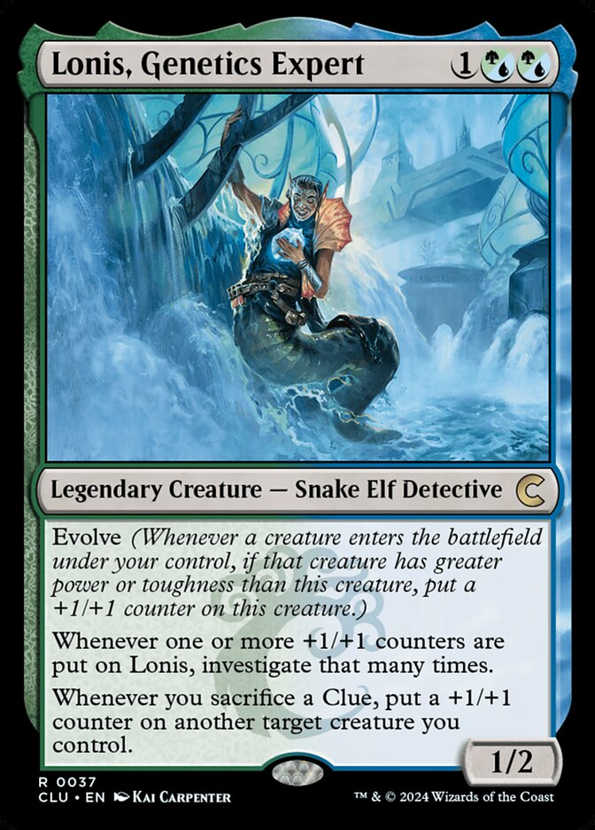

# lonis

Collection of python tools for answering odd questions I've had when building commander decks.

Data is pulled from [mtgjson.com](https://mtgjson.com/) and cached locally at `~/.cache/lonis/` so we don't abuse a wonderful public resource.

Named after [Lonis, Genetics Expert](https://scryfall.com/card/mh3/185/lonis-genetics-expert).



## Install

Dependencies:
- [`uv`](https://docs.astral.sh/uv/#installation)
- [`git`](https://git-scm.com/install)

```bash
git clone git@github.com:znorgaard/lonis.git
cd lonis
uv sync
```

## Usage

To see a list of available tools:

```bash
uv run lonis --help
```

### Counting Creature Types

The `creature-types` subcommand is intended to help find unique or popular creature types.

The default is to count the occurence of each creature type across all commander valid cards.


```bash
uv run lonis creature-types \
    --output all_creature_types.tsv
```

You can specify a different magic format or restrict based on color identity.

```bash
uv run lonis creature-types \
    --format commander \
    --identity ug
    --output simic_creature_types.tsv
```

## Contributing

See [CONTRIBUTING.md](CONTRIBUTING.md) for development setup and how to add new tools.
